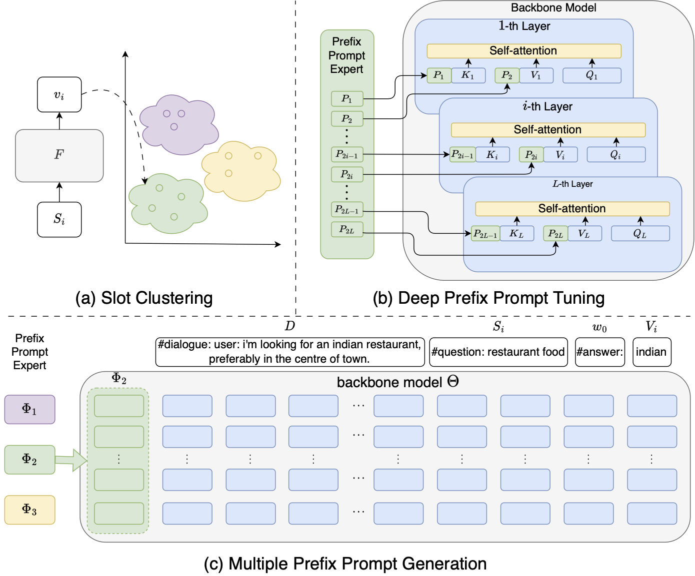

# MPPE-DST: Mixture of Prefix Prompt Experts for LLM in Zero-Shot Dialogue State Tracking

## Abstract

Zero-shot dialogue state tracking (DST) transfers knowledge to unseen domains, reducing the cost of annotating
new datasets. Previous zero-shot DST models mainly suffer from domain transferring and partial prediction prob-
lems. To address these challenges, we propose Mixture of Prefix Prompt Experts (MPPE) to establish connections
between similar slots in different domains, which strengthens the model transfer performance in unseen domains.
Empirical results demonstrate that MPPE-DST achieves the joint goal accuracy of 57.13% on MultiWOZ2.1 and
55.40% on SGD.

## Model Architecture


Illustration of our proposed method, including (a) Slot clustering, (b) Deep Prefix Prompt Tuning, and (c) Multiple
Prefix Prompt Generation. Slot clustering is used to categorize all slots into distinct clusters and establishes
connections between slots in different domains. Deep Prefix Prompt Tuning is our method to strengthen the LLM's
conditional generation. Multiple Prefix Prompt Generation shows the complete pipeline of solving DST task.

## Depenedency

### Download packages

```bash
pip install -r requirements.txt
```

### Download pretrained model

[chatglm-6b download link](https://huggingface.co/THUDM/chatglm-6b)

### Download & process source data

```shell
bash download_process_data.sh
```
## Train & Evaluate

```bash
bash run.sh
```
